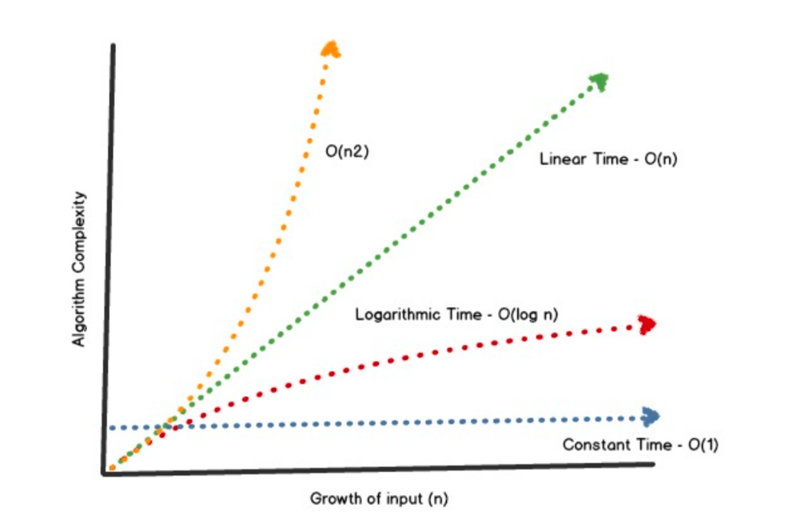

# Blockchain Data Storage

## Merkle Trees

-   Structure used in computer science to validate data
-   Thanks to Merkle Trees we have a structure with logarithmic time, `O(log n)`
    -   You don’t need all the data to retrieve certain output
-   Store every transaction in an efficient way - Useful for data verification
    

```
Bitcoin block’s architecture:
························
HEADER
························
Version
prevBlockHash
merkleRootHash -> SHA256 of block’s transactions
Timestamp
Bits
Nonce
························
TRANSACTION
························
Coinbase Tx
More Txs
························
```

-   All of the latest transactions are added in the current block and they become a MerkleRootHash when the block is mined
-   The latest layer of the node can be stored off-chain by nodes
-   Since is just a hash it increases the performance of the storage and it reduces its size, keeping it as small as possible
    -   Space and computationally efficient
        -   Significantly reduce the memory needed to verify data
        -   Require less data to be broadcast across the blockchain network to verify data and transactions
            -   It needs a MerklePath (information needed to calculate the expected value for the Merkle Root for a block)
        -   Allow Simple Payment Verification (SPV), (verify a transaction without downloading an entire block or blockchain)
            -   Using a light-client node -> Crypto wallets
    -   Good for scalability and decentralization
    -   No need to pack a block full of transactions, just needs the Merkle root hash
-   Merkle Proofs:
    -   Recursive hashing algorithm
    -   Allows efficient proof of data
    -   The root hash is included inside the block
    -   Confirms specific transactions represented by a leaf or branch hash in a specific block, it includes the MerklePath and MerkleRoot
    -   Verification needs a prover and a verifier
        -   Prover: Does all the calculation to create the merkle root
        -   Verifier: Does not need to know all the values to know for certain one value is in the tree
