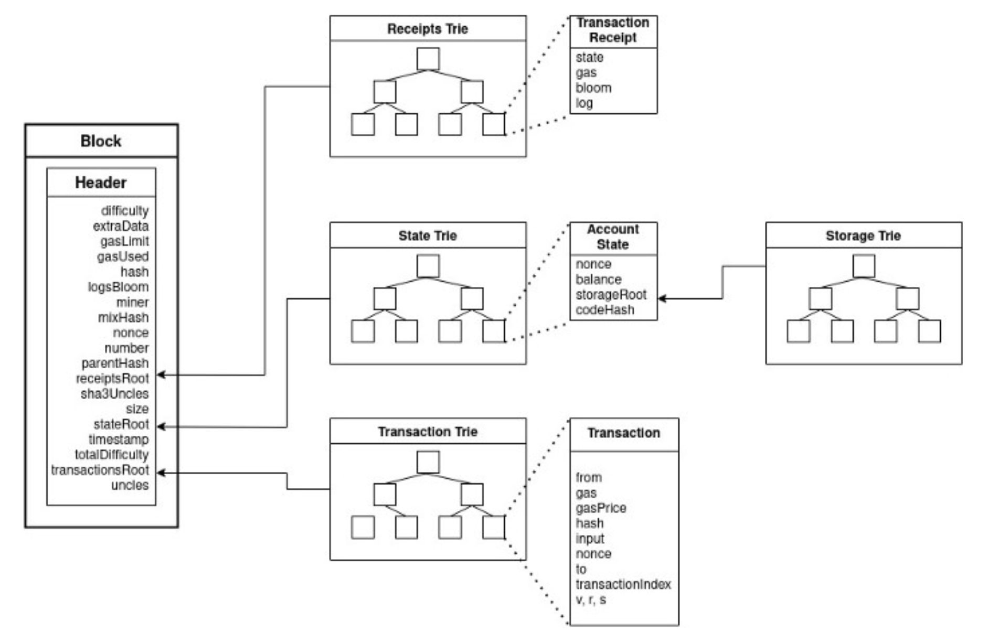

# Blockchain Data Storage

## Merkle Trees

-   Structure used in computer science to validate data
-   Thanks to Merkle Trees we have a structure with logarithmic time, `O(log n)`
    -   You don’t need all the data to retrieve certain output
-   Store every transaction in an efficient way - Useful for data verification
    

```
Bitcoin block’s architecture:
························
HEADER
························
Version
prevBlockHash
merkleRootHash -> SHA256 of block’s transactions
Timestamp
Bits
Nonce
························
TRANSACTION
························
Coinbase Tx
More Txs
························
```

-   All of the latest transactions are added in the current block and they become a MerkleRootHash when the block is mined
-   The latest layer of the node can be stored off-chain by nodes
-   Since is just a hash it increases the performance of the storage and it reduces its size, keeping it as small as possible
    -   Space and computationally efficient
        -   Significantly reduce the memory needed to verify data
        -   Require less data to be broadcast across the blockchain network to verify data and transactions
            -   It needs a MerklePath (information needed to calculate the expected value for the Merkle Root for a block)
        -   Allow Simple Payment Verification (SPV), (verify a transaction without downloading an entire block or blockchain)
            -   Using a light-client node -> Crypto wallets
    -   Good for scalability and decentralization
    -   No need to pack a block full of transactions, just needs the Merkle root hash
-   Merkle Proofs: - Recursive hashing algorithm - Allows efficient proof of data - The root hash is included inside the block - Confirms specific transactions represented by a leaf or branch hash in a specific block, it includes the MerklePath and MerkleRoot - Verification needs a prover and a verifier - Prover: Does all the calculation to create the merkle root - Verifier: Does not need to know all the values to know for certain one value is in the tree
    Alchemy

## Ethereum Storage

-   Ethereum uses Merkle Trees and Patricia Merkle Tries since it’s different from Bitcoin

### Trees in Ethereum

-   Ethereum uses Radix Trie (Patricia Trie or a Radix Tree) combined with a Merkle Tree and creating a Patricia Merkle Trie (pronounced tree or try)
-   `Patricia Trie + Merkle Tree = Patricia Merkle Trie`

### Radix Trie

-   Tree-like data structure
    -   Retrieves a string value traversing down a branch of nodes that store associated references (keys) that lead to the end value that can be returned
    -   Search for the end value is optimized and more efficient by grouping the associated keys

### Patricia Merkle Trees

-   Data that stores key-value pairs (hash table)
-   Allows data verification, integrity and inclusion of the key-value pair
-   Groups similar-value nodes in the tree (HELLO and HELP lead a similar search)
-   Efficient for data verification and efficient for editing data

    ```
    P - Practical
    A - Algorithm
    T - To
    R - Retrieve
    I - Information
    C - Coded
    I - In
    A - Alphanumeric
    ```

-   Ethereum uses it to manage data
    -   Permanent Data
        -   Transactions: You can return to the same path over and over to retrieve the same result
        -   Perfect for Merkle Tree
    -   Ephemeral Data
        -   Account state changes: Nonce, Balance, Storage Root, codeHash
        -   State in constant updates, new accounts all the time, keys in storage constantly inserted and deleted

### Ethereum Block Header

-   Is the hash (KECCAK-256) with all the data mined
-   Acts as a mapping between addresses and account states
-   All the information about accounts are stored in the world state trie and you can retrieve information by querying it

    ```
    Ethereum Block Architecture
    ····························································
    HEADER
    ····························································
    PrevHash
    Nonce
    Timestamp
    Uncle Hash
    Beneficiary
    Logs Bloom
    Difficulty
    Extra Data
    Block Num
    Gas Limit
    Gas Used
    Mix Hash
    State Root
        - The root hash of the state trie
        - {key: Address 0x5...6, value: [Nonce, Balance, Codehash, Storage Root]}
            - Storage root is the hash of the storage trie’s root node
    Transaction Root
        - The root hash of the block's transactions
        - Tx Merkle Tree Root for the block
    Receipt Root
        - The root hash of the receipts trie
        - Receipt Merkle Tree for the block
    ····························································
    ```

### Ethereum: Transaction Trie

-   Records transactions in Ethereum -> Once mined never updated
-   Each transaction records multiple entries of each Tx (gasPrice, value)

    ```JSON
    {
    "jsonrpc": "2.0",
    "id": 0,
    "result": {
            "blockHash": "0x7fdfd406b117a91aaed2c060862274935e35412a2c1567df154e1ac9fc02d07a",
            "blockNumber": "0x1010069",
            "hash": "0xefd4e0b81de761630e93f87d3209b152f788c69dcf80b32902cf8579963bf131",
            "accessList": [],
            "chainId": "0x1",
            "from": "0x137cd8b1de201729e544e2585d4f1a24c2d1a5e5",
            "gas": "0x5e5b0",
            "gasPrice": "0x6095288d1",
            "input": "0x12aa3caf0000000000000000000000007122db0ebe4eb9b434a9f2ffe6760bc03bfbd0e000000000000000000000000004fa0d235c4abf4bcf4787af4cf447de572ef828000000000000000000000000eeeeeeeeeeeeeeeeeeeeeeeeeeeeeeeeeeeeeeee0000000000000000000000007122db0ebe4eb9b434a9f2ffe6760bc03bfbd0e0000000000000000000000000137cd8b1de201729e544e2585d4f1a24c2d1a5e5000000000000000000000000000000000000000000000005b9e925592883000000000000000000000000000000000000000000000000000001d4dcdd4e9f5066000000000000000000000000000000000000000000000000000000000000000400000000000000000000000000000000000000000000000000000000000001400000000000000000000000000000000000000000000000000000000000000160000000000000000000000000000000000000000000000000000000000000000000000000000000000000000000000000000000000000000000000000000001270000000000000000000000000000000001090000f30000b700006800004e80206c4eca2704fa0d235c4abf4bcf4787af4cf447de572ef828acf98af36845ec9aeda29feed2907ea287388cf300000000000000000000000000000000000000000000000024a5d4223a9ce0000020d6bdbf7804fa0d235c4abf4bcf4787af4cf447de572ef82802a000000000000000000000000000000000000000000000000001d4dcdd4e9f5066ee63c1e501157dfa656fdf0d18e1ba94075a53600d81cb3a9704fa0d235c4abf4bcf4787af4cf447de572ef8284101c02aaa39b223fe8d0a0e5c4f27ead9083c756cc200042e1a7d4d0000000000000000000000000000000000000000000000000000000000000000c0611111111254eeb25477b68fb85ed929f73a96058200000000000000000000000000000000000000000000000000c12c1355",
            "maxFeePerGas": "0x7cc65d49e",
            "maxPriorityFeePerGas": "0x47b7600",
            "nonce": "0x4b",
            "r": "0x491bd88d66e1aa22e6de9e4e544989cb6b27cb426a936ef2935543bc19ef8afa",
            "s": "0x3d03c2237c599c0b4f5839dac3ffa1ce68ab8d694c24919f9280aebf09217709",
            "to": "0x1111111254eeb25477b68fb85ed929f73a960582",
            "transactionIndex": "0x24",
            "type": "0x2",
            "v": "0x1",
            "value": "0x0"
        }
    }
    ```

### Ethereum: Transaction Receipt Trie

-   Records receipts (outcomes) of transactions.
-   Includes gasUsed and logs (events from contracts)
-   Once mined, never updated

    ```JSON
    {
      "jsonrpc": "2.0",
      "id": 0,
      "result": {
        "transactionHash": "0xefd4e0b81de761630e93f87d3209b152f788c69dcf80b32902cf8579963bf131",
        "blockHash": "0x7fdfd406b117a91aaed2c060862274935e35412a2c1567df154e1ac9fc02d07a",
        "blockNumber": "0x1010069",
        "logs": [
          {
            "transactionHash": "0xefd4e0b81de761630e93f87d3209b152f788c69dcf80b32902cf8579963bf131",
            "address": "0x04fa0d235c4abf4bcf4787af4cf447de572ef828",
            "blockHash": "0x7fdfd406b117a91aaed2c060862274935e35412a2c1567df154e1ac9fc02d07a",
            "blockNumber": "0x1010069",
            "data": "0x000000000000000000000000000000000000000000000005b9e9255928830000",
            "logIndex": "0x52",
            "removed": false,
            "topics": [
              "0xddf252ad1be2c89b69c2b068fc378daa952ba7f163c4a11628f55a4df523b3ef",
              "0x000000000000000000000000137cd8b1de201729e544e2585d4f1a24c2d1a5e5",
              "0x0000000000000000000000007122db0ebe4eb9b434a9f2ffe6760bc03bfbd0e0"
            ],
            "transactionIndex": "0x24"
          },
          {
            "transactionHash": "0xefd4e0b81de761630e93f87d3209b152f788c69dcf80b32902cf8579963bf131",
            "address": "0x04fa0d235c4abf4bcf4787af4cf447de572ef828",
            "blockHash": "0x7fdfd406b117a91aaed2c060862274935e35412a2c1567df154e1ac9fc02d07a",
            "blockNumber": "0x1010069",
            "data": "0x0000000000000000000000000000000000000000000000000000000000000000",
            "logIndex": "0x53",
            "removed": false,
            "topics": [
              "0x8c5be1e5ebec7d5bd14f71427d1e84f3dd0314c0f7b2291e5b200ac8c7c3b925",
              "0x000000000000000000000000137cd8b1de201729e544e2585d4f1a24c2d1a5e5",
              "0x0000000000000000000000001111111254eeb25477b68fb85ed929f73a960582"
            ],
            "transactionIndex": "0x24"
          },
          {
            "transactionHash": "0xefd4e0b81de761630e93f87d3209b152f788c69dcf80b32902cf8579963bf131",
            "address": "0x04fa0d235c4abf4bcf4787af4cf447de572ef828",
            "blockHash": "0x7fdfd406b117a91aaed2c060862274935e35412a2c1567df154e1ac9fc02d07a",
            "blockNumber": "0x1010069",
            "data": "0x00000000000000000000000000000000000000000000000024a5d4223a9ce000",
            "logIndex": "0x54",
            "removed": false,
            "topics": [
              "0xddf252ad1be2c89b69c2b068fc378daa952ba7f163c4a11628f55a4df523b3ef",
              "0x0000000000000000000000007122db0ebe4eb9b434a9f2ffe6760bc03bfbd0e0",
              "0x000000000000000000000000acf98af36845ec9aeda29feed2907ea287388cf3"
            ],
            "transactionIndex": "0x24"
          },
          {
            "transactionHash": "0xefd4e0b81de761630e93f87d3209b152f788c69dcf80b32902cf8579963bf131",
            "address": "0xc02aaa39b223fe8d0a0e5c4f27ead9083c756cc2",
            "blockHash": "0x7fdfd406b117a91aaed2c060862274935e35412a2c1567df154e1ac9fc02d07a",
            "blockNumber": "0x1010069",
            "data": "0x00000000000000000000000000000000000000000000000001d99946fa154974",
            "logIndex": "0x55",
            "removed": false,
            "topics": [
              "0xddf252ad1be2c89b69c2b068fc378daa952ba7f163c4a11628f55a4df523b3ef",
              "0x000000000000000000000000157dfa656fdf0d18e1ba94075a53600d81cb3a97",
              "0x0000000000000000000000007122db0ebe4eb9b434a9f2ffe6760bc03bfbd0e0"
            ],
            "transactionIndex": "0x24"
          },
          {
            "transactionHash": "0xefd4e0b81de761630e93f87d3209b152f788c69dcf80b32902cf8579963bf131",
            "address": "0x04fa0d235c4abf4bcf4787af4cf447de572ef828",
            "blockHash": "0x7fdfd406b117a91aaed2c060862274935e35412a2c1567df154e1ac9fc02d07a",
            "blockNumber": "0x1010069",
            "data": "0x00000000000000000000000000000000000000000000000595435136ede62000",
            "logIndex": "0x56",
            "removed": false,
            "topics": [
              "0xddf252ad1be2c89b69c2b068fc378daa952ba7f163c4a11628f55a4df523b3ef",
              "0x0000000000000000000000007122db0ebe4eb9b434a9f2ffe6760bc03bfbd0e0",
              "0x000000000000000000000000157dfa656fdf0d18e1ba94075a53600d81cb3a97"
            ],
            "transactionIndex": "0x24"
          },
          {
            "transactionHash": "0xefd4e0b81de761630e93f87d3209b152f788c69dcf80b32902cf8579963bf131",
            "address": "0x157dfa656fdf0d18e1ba94075a53600d81cb3a97",
            "blockHash": "0x7fdfd406b117a91aaed2c060862274935e35412a2c1567df154e1ac9fc02d07a",
            "blockNumber": "0x1010069",
            "data": "0x00000000000000000000000000000000000000000000000595435136ede62000fffffffffffffffffffffffffffffffffffffffffffffffffe2666b905eab68c00000000000000000000000000000000000000000938cb2b239727f2dc62b3fc0000000000000000000000000000000000000000000001a49b79fa9cd392fcbffffffffffffffffffffffffffffffffffffffffffffffffffffffffffffefc54",
            "logIndex": "0x57",
            "removed": false,
            "topics": [
              "0xc42079f94a6350d7e6235f29174924f928cc2ac818eb64fed8004e115fbcca67",
              "0x0000000000000000000000007122db0ebe4eb9b434a9f2ffe6760bc03bfbd0e0",
              "0x0000000000000000000000007122db0ebe4eb9b434a9f2ffe6760bc03bfbd0e0"
            ],
            "transactionIndex": "0x24"
          },
          {
            "transactionHash": "0xefd4e0b81de761630e93f87d3209b152f788c69dcf80b32902cf8579963bf131",
            "address": "0xc02aaa39b223fe8d0a0e5c4f27ead9083c756cc2",
            "blockHash": "0x7fdfd406b117a91aaed2c060862274935e35412a2c1567df154e1ac9fc02d07a",
            "blockNumber": "0x1010069",
            "data": "0x00000000000000000000000000000000000000000000000001d99946fa154974",
            "logIndex": "0x58",
            "removed": false,
            "topics": [
              "0x7fcf532c15f0a6db0bd6d0e038bea71d30d808c7d98cb3bf7268a95bf5081b65",
              "0x0000000000000000000000007122db0ebe4eb9b434a9f2ffe6760bc03bfbd0e0"
            ],
            "transactionIndex": "0x24"
          }
        ],
        "contractAddress": null,
        "effectiveGasPrice": "0x6095288d1",
        "cumulativeGasUsed": "0x40f91e",
        "from": "0x137cd8b1de201729e544e2585d4f1a24c2d1a5e5",
        "gasUsed": "0x4539d",
        "logsBloom": "0x00000000000000000000000000000000000000000000000000000000000000040004000000000000000002000000000002000000080020000000000000a00000000000000000080800000008000000000000000400400010000000000000000000000000000000000000000000000000000020000000040000000010008802000000000000000000000000000000000000000000000000000000000800000000022000000000000000000000000204000000000000000000000040000000000000000002000200800000000200000000000100000000000000000002000000000010201000000000000400000000000000000000000000000000000000000000",
        "status": "0x1",
        "to": "0x1111111254eeb25477b68fb85ed929f73a960582",
        "transactionIndex": "0x24",
        "type": "0x2"
      }
    }
    ```

## Conclusion

-   Tries are committed in every block by their root hash (check diagram)



-   Raw data is stored in archive nodes
-   Knowing about data structures is fundamental to optimize our applications
