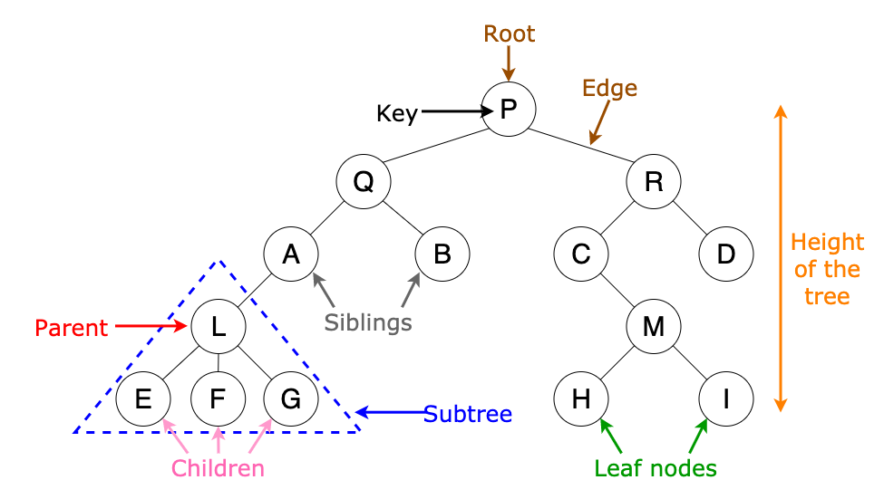

# Tree Data Structures

## Tree basics

-   Root at the top (parent)
-   Children at the botom (nodes related to parent)
    -   Node: basic unit of data structure
    -   Node (computer systems): Network peer communicating data
-   Example:
    -   Linked list that only has just one children per ramification
    -   Each node of a binary tree has 2 children
-   A tree can have one or multiple ramifications
-   Last level of a tree are the leaves and they have no further children

### Terminology



-   Key: data inside the node
-   Root: top level parent
-   Siblings: same parent and same level nodes
-   Subtree: isolated tree from another tree
-   The search time of this kind of structure always remains logarithmic O(log n) where n are the nodes

    -   The searching time remains logarithmic
    -   Big O analysis is important to choose the most efficient data structure and to maintain it close to Constant time

### Usage

-   A tree is good for hierarchic data
-   Good for searching and sorting data
-   It’s also good for algorithm design, recursion works well with them

### Examples

#### Node

```JS
// Node

class Node {
    constructor(data) {
        this.data = data;
        this.left = null;
        this.right = null;
    }
}

module.exports = Node;
```

#### Tree

```JS
// Simple tree example

class Tree {
    constructor() {
        // Started without root
        this.root = null;
    }
    // Adding node logic
    addNode(node) {
        // First node will be the root
        if (!this.root) this.root = node;
        // The children nodes will be added recursively
        else this.recursiveAdd(this.root, node);
    }
    recursiveAdd(parent, child) {
        // Left children
        if (child.data <= parent.data) {
            if (!parent.left) parent.left = child;
            else this.recursiveAdd(parent.left, child);
        }
        // Right children
        if (child.data >= parent.data) {
            if (!parent.right) parent.right = child;
            else this.recursiveAdd(parent.right, child);
        };
    }
    // Finding node logic
    hasNode(num) {
        return !this.root ? false
            : this.recursiveFind(this.root, num);
    }
    recursiveFind(node, num) {
        // Default scenario
        if (num === node.data) return true;
        // Left children
        if (num < node.data)
            return !node.left ? false
                : this.recursiveFind(node.left, num);
        // Right children
        if (num > node.data)
            return !node.right ? false
                : this.recursiveFind(node.right, num);
    }
}

module.exports = Tree;
```

## Merkle Tree

-   It's a data structure that allows to make verifications to data that belongs to a large set of data.

    -   Commonly used in Peer to Peer networks
    -   Efficient proofs help increase the scalability of the network

-   It's a collection of hashes reduced to a single hash
-   All hashes are combined into a single, unique hash, allowing us to check for inconsistencies without looking at each data point
-   Tt allows to verify that a single piece of data belongs to the tree without having all of the data
-   With larger trees, the average case for verification of tree is `log2(n)` where `n` is the `number of nodes` in the tree
    -   For a tree of size 128, it would take only 7 hashes to determine the root
-   Storing transactions as Merkle Trees allows us to look at a block and verify that a transaction was part of it by only having part of the data set

```JS
// Merkle Tree example

class MerkleTree {
    constructor(leaves, concat) {
        // An array of leaf nodes
        this.leaves = leaves;
        // This function joins 2 nodes
        this.concat = concat;
    }
    getRoot() {
        // Base cases
        if (!this.leaves.length)
            return null;      
        if (this.leaves.length === 1)
            return this.leaves[0];
        // Consume a larger array
        return this.recursiveGet([...this.leaves]);
    }
    recursiveGet(leaves) {
        // Minimum case of large array
        if (leaves.length === 2)
            return this.concat(...leaves);
        // Larger arrays consumed with recursion
        if(leaves.length > 2) {
            // Divide by half
            const half = Math.ceil(leaves.length / 2);
            const [left, right] = [
                leaves.slice(0, half), leaves.slice(half)
            ];
            // Consume
            return this.concat(
                this.recursiveGet(left),
                this.recursiveGet(right)
            );
        }
    }
}

module.exports = MerkleTree;
```
